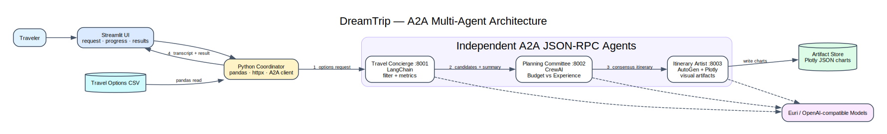

# DreamTrip A2A Architecture

This package is the short, implementation-aligned entry point to the repository's detailed `docs/` material.

## Read in this order

1. [High-level design](HLD.md) — orchestration, A2A boundaries, agents, artifacts, and operations.
2. [Primary sequence](SEQUENCE.md) — concierge, committee, and artist collaboration.
3. [System diagram source](diagrams/system-architecture.dot) — editable Graphviz source.
4. [Sequence diagram source](diagrams/planning-sequence.dot) — editable Graphviz source.
5. [Detailed architecture](../docs/architecture.md) — class- and handler-level reference already maintained in the repository.

## Code map

| Area | Implementation |
|---|---|
| Streamlit experience | `src/ui/app.py` |
| Workflow coordinator | `src/orchestrator.py` |
| A2A protocol servers | `src/a2a_servers.py`, `src/a2a_utils.py` |
| LangChain concierge | `src/agents/langchain_agent.py` |
| CrewAI planning committee | `src/agents/crewai_agent.py` |
| AutoGen itinerary artist | `src/agents/autogen_agent.py` |
| Source data | `data/travel_options.csv` |
| Deployment | `Dockerfile`, `entrypoint.sh`, `DEPLOY.md` |
