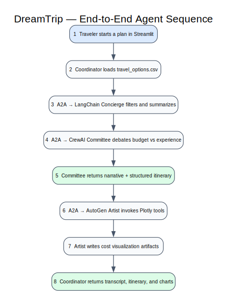

# Trip Planning Sequence

1. The traveler starts a plan in Streamlit.
2. The coordinator reads `travel_options.csv` and constructs an A2A message with CSV content and the requested model.
3. The LangChain Concierge returns structured candidate records and cost metrics.
4. The coordinator forwards the candidates and summary to the CrewAI Planning Committee.
5. Budget Watchdog and Experience Guru debate the trade-offs and agree on a final itinerary.
6. The coordinator sends the itinerary and original options to the AutoGen Itinerary Artist.
7. AutoGen calls the Plotly rendering tool and writes cost-by-name and cost-by-type JSON artifacts.
8. The coordinator aggregates agent cards, transcript, structured output, and artifact paths for Streamlit.

## Protocol notes

Each agent is a FastAPI application wrapped by the A2A SDK. The coordinator discovers the card, sends a non-streaming JSON-RPC message, accepts a final `Message` or task-history message, and closes both A2A and HTTP clients.

## Failure behavior

- Concierge failure stops downstream planning because no validated option set exists.
- Committee failure preserves Concierge output for inspection or retry.
- Artist failure should preserve the negotiated itinerary even when charts cannot be generated.
- Timeouts and invalid data parts become explicit workflow errors rather than silent empty results.
